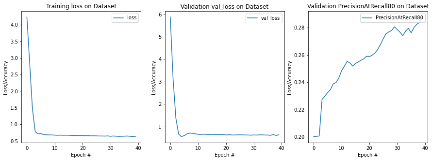
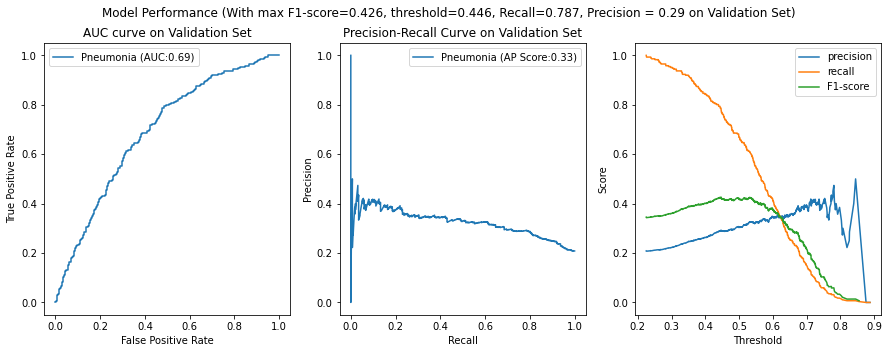
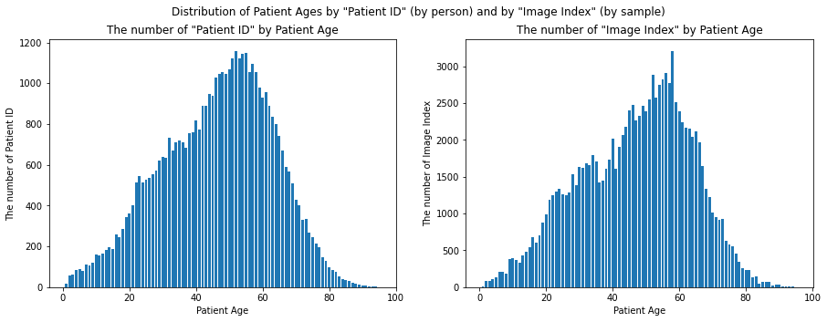
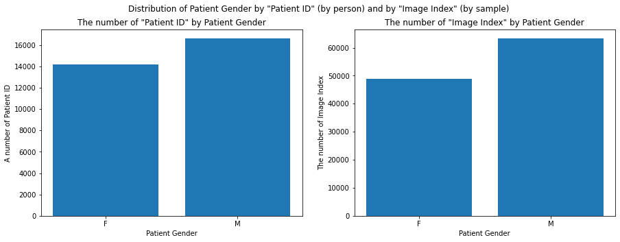
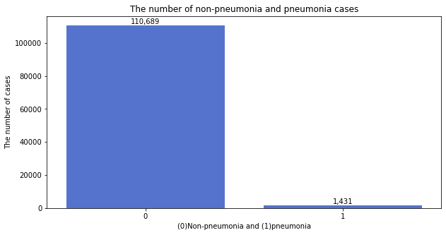
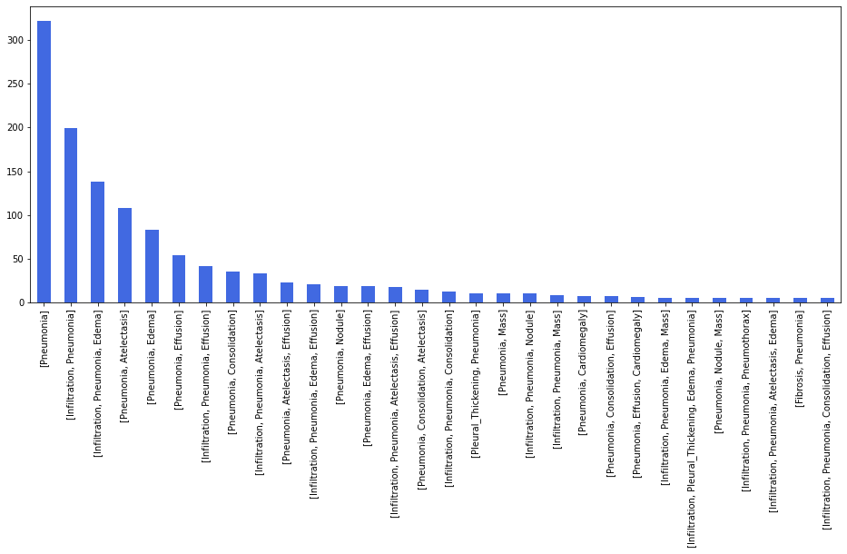
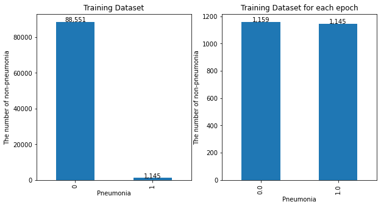
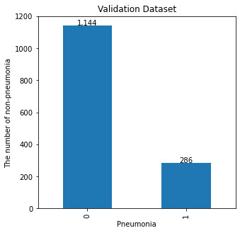

# Pneumonia-Detection-From-Chest-X-Rays

**Note:** This is just the research project. It is not recommended to be used directly in production.

**Name of the Device:** CheXCNN

## Algorithm Description 

### 1. General Information

**Intended Use Statement:** This algorithm is intended for use in assisting a radiologist with pneumonia screening from chest x-rays.

**Indications for Use:** It is indicated for use in patients (male and female) within the age bracket 1-95 years with chest x-rays taken in the AP and PA view positions on a ER setting

**Device Limitations:** It is alright to have high False Positive (FP) or False discovery rate for screening but False Negative (FN) or False Negative Rate (FNR) needs to be low. The reason is because for screening, FP cases can be read again by the radiologist but FP maybe ignored or have very low priority to read. The presence of Atelectasis or Nodule may reduce the model performance of the algorithm in FNR of predicting the presence of pneumonia in a chest x-ray. 

**Clinical Impact of Performance:** This algorithm's performance shows that it will be useful for screening chest x-rays for pneumonia and may also be used for workflow prioritization.

### 2. Algorithm Design and Function

**DICOM Checking Steps:**  Check DICOM Headers for:

1. Modality == 'DX'
2. BodyPartExamined=='CHEST'
3. PatientPosition in 'PA' or 'AP' Position

If any of these three categories do not match their respective requirements, then a message will state that the DICOM does not meet criteria.

**Preprocessing Steps:** 

1. Image standardization:  standardized_pixel = pixel/ 255.0 
2. Image resizing: resize image to (224, 224)

**CNN Architecture:**

The model architecture :

1. Pre-existing architecture:  model_2 (Model) 
2. Layers added to pre-existing architecture: flatten_2(Flatten) and dense_2(Dense)

```
Model: "sequential_2"
_________________________________________________________________
Layer (type)                 Output Shape              Param #   
=================================================================
model_2 (Model)              (None, 7, 7, 512)         14714688  
_________________________________________________________________
flatten_2 (Flatten)          (None, 25088)             0         
_________________________________________________________________
dense_2 (Dense)              (None, 1)                 25089     
=================================================================
Total params: 14,739,777
Trainable params: 2,384,897
Non-trainable params: 12,354,880
_________________________________________________________________
```

The Pre-existing architecture "model_2 (Model)" 

```
Model: "model_2"
_________________________________________________________________
Layer (type)                 Output Shape              Param #   
=================================================================
input_2 (InputLayer)         (None, 224, 224, 3)       0         
_________________________________________________________________
block1_conv1 (Conv2D)        (None, 224, 224, 64)      1792      
_________________________________________________________________
block1_conv2 (Conv2D)        (None, 224, 224, 64)      36928     
_________________________________________________________________
block1_pool (MaxPooling2D)   (None, 112, 112, 64)      0         
_________________________________________________________________
block2_conv1 (Conv2D)        (None, 112, 112, 128)     73856     
_________________________________________________________________
block2_conv2 (Conv2D)        (None, 112, 112, 128)     147584    
_________________________________________________________________
block2_pool (MaxPooling2D)   (None, 56, 56, 128)       0         
_________________________________________________________________
block3_conv1 (Conv2D)        (None, 56, 56, 256)       295168    
_________________________________________________________________
block3_conv2 (Conv2D)        (None, 56, 56, 256)       590080    
_________________________________________________________________
block3_conv3 (Conv2D)        (None, 56, 56, 256)       590080    
_________________________________________________________________
block3_pool (MaxPooling2D)   (None, 28, 28, 256)       0         
_________________________________________________________________
block4_conv1 (Conv2D)        (None, 28, 28, 512)       1180160   
_________________________________________________________________
block4_conv2 (Conv2D)        (None, 28, 28, 512)       2359808   
_________________________________________________________________
block4_conv3 (Conv2D)        (None, 28, 28, 512)       2359808   
_________________________________________________________________
block4_pool (MaxPooling2D)   (None, 14, 14, 512)       0         
_________________________________________________________________
block5_conv1 (Conv2D)        (None, 14, 14, 512)       2359808   
_________________________________________________________________
block5_conv2 (Conv2D)        (None, 14, 14, 512)       2359808   
_________________________________________________________________
block5_conv3 (Conv2D)        (None, 14, 14, 512)       2359808   
_________________________________________________________________
block5_pool (MaxPooling2D)   (None, 7, 7, 512)         0         
=================================================================
Total params: 14,714,688
Trainable params: 2,359,808
Non-trainable params: 12,354,880
_________________________________________________________________
```

The architecture of Pre-existing architecture is VGG16

### 3. Algorithm Training

**Parameters:**
* Types of augmentation used during training
  * Horizontal_flip
  * Height_shift_range = 0.1
  * Width_shift_range = 0.1
  * Rotation_range = 5
  * Shear_range = 0.05
  * Zoom_range = 0.05
* Batch_size
  * 256
* Optimizer learning rate
  * Cyclical Learning Rate
    * initial_learning_rate = 4e-6
    * maximal_learning_rate = 2e-4
    * step_size = 27
* Layers of pre-existing architecture that were frozen
  * First 17 layers are frozen  
* Layers of pre-existing architecture that were fine-tuned
  * block5_conv3 were fine-tuned
* Layers added to pre-existing architecture
  * flatten_2 (Flatten) 
  * dense_2 (Dense)  



Note that PrecisionAtRecall80 means max precision when recall >= 0.8.

**Final Threshold and Explanation:** 

Selected threshold = 0.43900916 with

1. Precision = 0.29 

2. Recall = 0.8

3. F1-score = 0.42

The criteria to choose the threshold is to find the threshold that maximizes precision at recall >= 0.8



### 4. Databases

**Description of the Original Dataset:** 

The dataset contains 112,120 chest X-ray images (Image Index) with 14 (unique) disease and 'No Finding' labels from 30,805 unique patients (Patient ID).







The distribution of top 30 diseases that are comorbid with pneumonia




**Description of Training Dataset:** 

The training dataset is an imbalanced dataset containing 1,145 pneumonia cases and a total of 89,696 images sampled from the Original Dataset (112,120 chest X-ray images with 14 (unique) disease and 'No Finding' labels from 30,805 unique patients).

However, the training dataset for each training epoch contains only 2,304  images and is almost balanced for Pneumonia and Non-Pneumonia labels by the sampling technique as follows.

1. 1,145 images of Pneumonia from training dataset
2. 1,159 images of Non-Pneumonia newly sampled from the training dataset every epoch 

The reason to use 2,304 number is that it can be divided by the batch size 256 that is used in the training process. (e.g. 2,304/256 = 9)



**Description of Validation Dataset:** 

The validation dataset is an imbalanced dataset containing 20% pneumonia cases and a total of 1430 images sampled from the Original Dataset (112,120 chest X-ray images with 14 (unique) disease and 'No Finding' labels from 30,805 unique patients).




### 5. Ground Truth

This NIH Chest X-ray Dataset is comprised of 112,120 X-ray images with disease labels from 30,805 unique patients. To create these labels, the authors used Natural Language Processing to text-mine disease classifications from the associated radiological reports. The labels are expected to be >90% accurate and suitable for weakly-supervised learning.

### 6. FDA Validation Plan

**Patient Population Description for FDA Validation Dataset:**

- Imaging modality
  - Chest x-rays taken in the AP and PA view 
- Age range
  - 1-95 years
- Gender distribution
  - Almost balanced male and female
- Prevalence of pneumonia 
  - 20% Prevalence of pneumonia 

**Ground Truth Acquisition Methodology:**

The majority vote of the 4 radiologists as ground truth.

**Algorithm Performance Standard:**

F1_score can be the performance standard as seen in CheXNet (Rajpurtar, et al., 2017)

